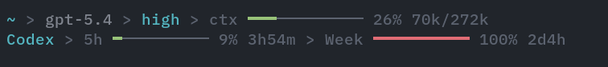
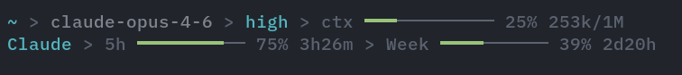

# pi-minimal-footer

Minimal footer for [pi](https://github.com/earendil-works/pi) that replaces the default footer with a compact two-line display:

1. **Left:** CWD, git branch, session title · **Right:** context gauge
2. **Left:** session token/cost stats · **Right:** subscription usage bars





## Features

- **Context gauge** — optional working directory and git branch, model, thinking level, and context window usage with token counts
- **Session title** — display name from `auto-session-name` / `/name`, on the first row after CWD/git
- **Session stats** — cumulative session totals in pi's default style (`↑50k ↓14k R340k CH90.1% $0.357`)
- **Subscription usage bars** — rolling window quotas with reset timers for supported providers
- **Auto-refresh** — fetches usage on startup and model switch, then every 5 minutes
- **Git integration** — branch name, dirty state, ahead/behind counts

## Supported providers

| Provider       | What it shows                                          |
| -------------- | ------------------------------------------------------ |
| Claude Max     | 5h + weekly rolling windows                            |
| OpenAI Codex   | Primary + secondary rolling windows                    |
| GitHub Copilot | Premium interactions + chat quotas                     |
| Google Gemini  | Pro + Flash remaining quotas                           |
| MiniMax        | 5h + weekly rolling windows (Token Plan, credit-based)  |
| MiniMax CN     | Same as MiniMax, China endpoint                        |
| Kimi Coding    | 5h + weekly rolling windows (Plan)                     |
| OpenCode Go    | Rolling + weekly + monthly subscription quotas          |
| Grok           | SuperGrok included-credit usage + reset time             |
| Cursor         | Included plan + Auto/API usage + billing-cycle reset     |

## Install

```bash
pi install npm:@ogulcancelik/pi-minimal-footer
```

## Configuration

Environment variables (all optional):

| Variable                        | Description                                              | Default |
| ------------------------------- | -------------------------------------------------------- | ------- |
| `PI_MINIMAL_FOOTER_SHOW_CWD`    | Show current working directory in footer status line     | `1`     |
| `PI_MINIMAL_FOOTER_SHOW_BRANCH` | Show git branch/dirty/ahead/behind in footer status line | `1`     |
| `PI_MINIMAL_FOOTER_SHOW_TITLE`  | Show session display name on the row under CWD           | `1`     |
| `OPENCODE_GO_WORKSPACE_ID`       | OpenCode Go workspace ID (`wrk_...`)                     | —       |
| `OPENCODE_GO_AUTH_COOKIE`        | OpenCode dashboard `auth` cookie                         | —       |
| `GROK_CLI_OAUTH_TOKEN`           | Optional Grok OAuth bearer override                      | —       |
| `XAI_OAUTH_TOKEN`                | Alternate Grok OAuth bearer override                     | —       |
| `CURSOR_USAGE_SESSION_TOKEN`     | Optional Cursor dashboard session-token fallback         | —       |

Accepted false values: `0`, `false`, `no`, `off` (case-insensitive).

OpenCode Go quota is not exposed by its API key today. To enable its usage bars, copy the workspace ID from `https://opencode.ai/workspace/<workspace-id>/go` and the `auth` cookie from your browser's storage for `opencode.ai`, then export the two `OPENCODE_GO_*` variables above. Keep the cookie private.

Grok usage works with OAuth subscription providers using the `xai-auth`, `grok-cli`, or `xai-oauth` provider ID. The optional environment token overrides take precedence; otherwise the footer asks pi's model registry for a current token, then falls back to the matching entry in `~/.pi/agent/auth.json` or `~/.grok/auth.json`. xAI API keys do not expose the SuperGrok subscription meter.

Cursor usage is enabled for the `cursor` provider registered by `@rahularya01/pi-cursor`. The footer follows that package's credential sources (`CURSOR_ACCESS_TOKEN`, Cursor CLI Keychain, Cursor IDE state, then Pi OAuth) and calls Cursor's native current-period usage endpoint. `CURSOR_USAGE_SESSION_TOKEN` is used only as a fallback.

## How it works

The footer reads context usage from the last assistant message's token counts (free — comes with every LLM response). Session totals (`↑` input, `↓` output, `R` cache read, optional `W` cache write, `CH%` cache hit rate, `$` cost) are summed across all assistant messages in the session and appended to the status line. Subscription usage is fetched from each provider's dedicated quota API using your existing provider credentials.

Usage is fetched:

- Once on startup
- Immediately on model switch (Ctrl+P)
- Every 5 minutes after that

Git state is refreshed:

- Once on startup
- When pi reports a branch change
- At the end of each turn

The footer adapts to narrow terminals by stacking lines vertically instead of the single-line wide layout.

## Known issues

### Claude Max usage bar not showing

Anthropic's OAuth usage endpoint (`/api/oauth/usage`) has been returning persistent 429 (rate limit) errors since late March 2026, affecting all third-party tools that display Claude usage data (CodexBar, oh-my-claudecode, claude-pulse, etc.). This is an Anthropic-side issue — tracked in [claude-code#30930](https://github.com/anthropics/claude-code/issues/30930) and [claude-code#31021](https://github.com/anthropics/claude-code/issues/31021). The usage bar will start working again once Anthropic fixes the endpoint.

## Notes

- Replaces the default pi footer entirely via `ctx.ui.setFooter()`
- Auth tokens are read from `~/.pi/agent/auth.json` (populated by `/login`) or standard env vars (`ANTHROPIC_API_KEY`, `MINIMAX_API_KEY`, etc.)
- OpenCode Go uses its dashboard page because the API-key usage endpoint is not publicly available; its cookie is sent only to `https://opencode.ai`
- Grok subscription usage uses the unofficial OAuth billing surface at `https://cli-chat-proxy.grok.com`; the endpoint may change
- Providers without auth simply don't show a usage bar — no errors
